<!-- logo -->

## About Me:
 - Automation & Intelligent Systems Student | Low-Level Enthusiast. - Industrial automation & energy sector convergence. My passion lies at the intersection of hardware and software. Diving deep into custom OS environments & cybersecurity. 

## Socials:
 

# Tech Stack:
            
# GitHub Stats:
 
 

### Random Dev Quote

---

  ## You can help me by Donating
  
   
  
  

